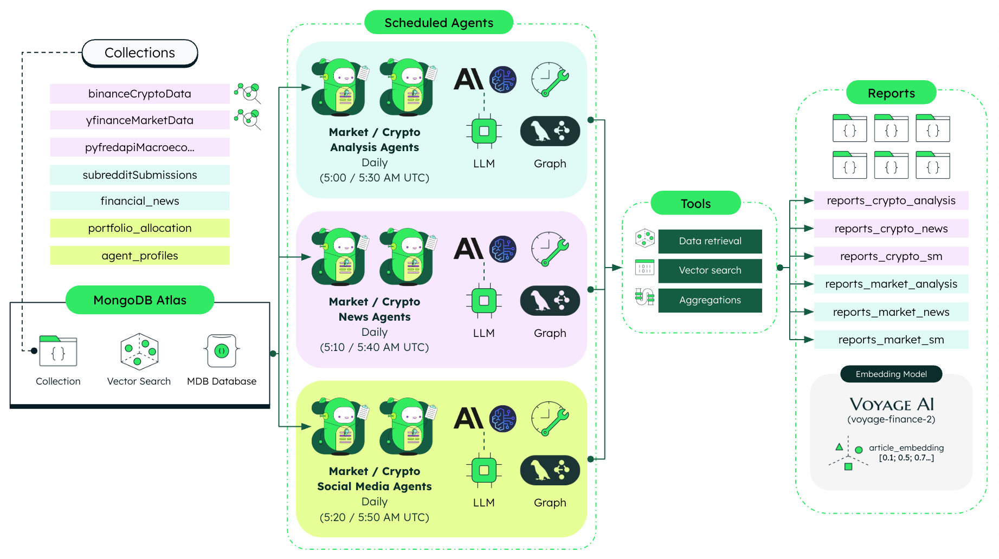

# Capital Markets Agents Service

This repository hosts the backend for the **Capital Markets Agents** service, a sophisticated AI-powered system that delivers automated financial intelligence to capital markets professionals. By combining real-time market data analysis, news sentiment processing, and portfolio insights, the service helps investment professionals make more informed decisions backed by comprehensive, data-driven intelligence.

## High Level Architecture



### Key Features

-  **Automated Intelligence**: Daily scheduled analysis of market trends and financial news
-  **Portfolio-Specific Insights**: Personalized recommendations based on current portfolio allocation
-  **Sentiment Analysis**: AI-powered processing of news sentiment and its potential impact on investments
-  **Vector Search**: Semantic understanding of financial news beyond simple keyword matching

### Technical Architecture
The service is built on a modular foundation using:

-  **LangGraph**: For orchestrating complex, multi-step agent workflows
-  **MongoDB Atlas**: For data persistence, time series analysis, and vector search capabilities
-  **FastAPI**: For reliable, documented API endpoints
-  **Financial Data Integration**: With Yahoo Finance and FRED economic indicators

## Agentic Workflows

###  1. Market Analysis Agent:

Analyzes asset trends, macroeconomic indicators, and market volatility to generate portfolio insights and recommendations.

> [!IMPORTANT]
> This agent workflow is scheduled to execute automatically **on a daily basis at 5:00 AM UTC**, delivering consistent market analysis reports for financial decision-making.

###  2. Market News Agent:

Processes financial news data to provide portfolio-specific sentiment analysis and summarized market intelligence, helping investors understand how current news may impact their investments.

> [!IMPORTANT]
> This agent workflow is scheduled to execute automatically **on a daily basis at 5:10 AM UTC**, delivering timely news sentiment reports for financial decision-making.

======================================================

> [!NOTE]
> The current implementation of both agent workflows has been intentionally streamlined for demonstration and educational purposes. While the workflows may appear relatively linear and deterministic, the underlying architecture has been designed with extensibility in mind. Some components are simplified or emulated to ensure predictable outputs and controllable execution flows during demonstrations. There is substantial room for increasing complexity in terms of perception (adding more data sources), planning (implementing more sophisticated decision trees or recursive reasoning), and overall reasoning capabilities (incorporating feedback loops or multi-agent collaboration). This foundation provides an excellent starting point for more advanced capital markets intelligence applications while maintaining clarity and reliability in the core functionality.

## Agent Tools

-  **Accessible for Market Analysis Agent:** 
   - **Portfolio Allocation Tool**: Retrieves current portfolio composition from MongoDB, including assets, descriptions, and allocation percentages.
   - **Asset Trends Tool**: Analyzes price movements of portfolio assets by comparing current prices with 50-day moving averages to identify trends.
   - **Macroeconomic Indicators Tool**: Evaluates key economic metrics (GDP, Effective Interest Rate, Unemployment Rate) from the FRED API to provide market context and asset allocation recommendations.
   - **Market Volatility Tool**: Assesses market risk using VIX index data, calculating percentage changes and providing guidance on equity exposure.
   - **Portfolio Overall Diagnosis Tool**: Generates comprehensive investment recommendations by synthesizing all analyses through an LLM (AWS Bedrock/Anthropic).

-  **Accessible for Market News Agent:** 
   - **Portfolio Allocation Tool**: Retrieves current portfolio composition from MongoDB, including assets, descriptions, and allocation percentages.
   - **Asset News Tool**: Uses MongoDB Atlas Vector Search to find relevant financial news articles for each portfolio asset, leveraging semantic search capabilities.
   - **Asset News Summary Tool**: Performs sentiment analysis on financial news, calculates sentiment scores, and generates concise summaries using AWS Bedrock/Anthropic LLM.
   
#### News Sentiment Logic (Vector Search)
The news sentiment logic utilizes MongoDB's Vector Search capabilities to enhance the analysis of financial news articles. The process involves two key components:

1. **Semantic Search Implementation**: Using MongoDB's Vector Search capability, the system can find semantically similar news articles based on these embeddings—identifying both explicit mentions of a ticker symbol and contextually relevant articles that don't directly reference it.

2. **Portfolio Sentiment Calculation**: For each asset in the portfolio, the system calculates an average sentiment score from its related articles, providing a consolidated sentiment indicator that helps assess market perception of that asset.

This approach enables both explicit keyword matching and deeper semantic understanding of financial news, offering more comprehensive insights than traditional text-based searches.

## Where Does MongoDB Shine?

MongoDB stands out as the ideal database solution for the Capital Markets Agents service, offering several key advantages for AI-driven financial intelligence workflows:

### Perfect Fit for Agentic Workflows

1. **Document Model:** MongoDB's document model stores data in JSON-like BSON format, which aligns perfectly with the agent state representation in LangGraph workflows. This enables near-seamless transitions between application objects and database storage with minimal serialization overhead.
2. **Agent State Management:** The service leverages MongoDB to store complex state objects from both Market Analysis and Market News agents. Each workflow stage can read from and write to MongoDB collections with minimal transformation, creating a natural persistence layer for multi-step AI processes.
3. **Agent Profiles Storage:** MongoDB efficiently stores and retrieves different agent profiles with distinct roles, instructions, and rules. The document model accommodates these nested, semi-structured configurations without requiring rigid schemas or complex joins.

### Advanced Financial Data Operations

4. **Time Series Collections:** For analyzing asset trends and market volatility, MongoDB's Time Series collections provide optimized storage and efficient querying of chronological market data from Yahoo Finance, supporting sophisticated trend analysis.
5. **Vector Search for News Intelligence:** The service's financial news functionality relies on MongoDB Atlas Vector Search to find semantically similar articles, enabling the discovery of related content beyond simple keyword matching and powering the sentiment analysis pipeline.
6. **Aggregation Pipelines:** Market analysis tools utilize MongoDB's powerful aggregation framework to calculate moving averages, assess macroeconomic indicators, and generate portfolio insights from raw financial data.

This combination of features enables the Capital Markets Agents service to maintain complex agent state, perform sophisticated financial data analysis, and deliver consistent AI-powered insights without the complexity of multiple specialized database systems.

## The 4 Pillars of the Document Model

1. **Easy**: [MongoDB's document model](https://www.mongodb.com/resources/basics/databases/document-databases) naturally fits with object-oriented programming, utilizing BSON documents that closely resemble JSON. This design simplifies the management of complex data structures such as user accounts, allowing developers to build features like account creation, retrieval, and updates with greater ease.

2. **Fast**: Following the principle of "Data that is accessed together should be stored together," MongoDB enhances query performance. This approach ensures that related data—like user and account information—can be quickly retrieved, optimizing the speed of operations such as account look-ups or status checks, which is crucial in services demanding real-time access to operational data.

3. **Flexible**: MongoDB's schema flexibility allows account models to evolve with changing business requirements. This adaptability lets financial services update account structures or add features without expensive and disruptive schema migrations, thus avoiding costly downtime often associated with structural changes.

4. **Versatile**: The document model in MongoDB effectively handles a wide variety of data types, such as strings, numbers, booleans, arrays, objects, and even vectors. This versatility empowers applications to manage diverse account-related data, facilitating comprehensive solutions that integrate user, account, and transactional data seamlessly.

## MongoDB Key Features

- **Document Model** - ([More info](https://www.mongodb.com/resources/products/fundamentals/basics#documents)): Perfect for storing complex agent states and profiles in native JSON format.
- **Time Series Collections**  ([More info](https://www.mongodb.com/products/capabilities/time-series)): Optimized storage and querying of chronological market data from Yahoo Finance.
- **Atlas Vector Search**  ([More info](https://www.mongodb.com/products/platform/atlas-vector-search)): For semantic search across financial news and report embeddings.
- **Aggregation Framework**  ([More info](https://www.mongodb.com/docs/manual/aggregation/)): Powers financial calculations like moving averages and trend analysis.
- **Schema Flexibility**  ([More info](https://www.mongodb.com/resources/products/fundamentals/why-use-mongodb)): Adapts to evolving agent workflows and data requirements without migrations.

## Tech Stack

- [MongoDB Atlas](https://www.mongodb.com/atlas/database) for database storage and vector search capabilities.
- [LangGraph](https://langchain-ai.github.io/langgraph/) for orchestrating multi-step agent workflows.
- [VoyageAI](https://www.voyageai.com/) for domain-specific financial embeddings.
- [AWS Bedrock/Anthropic](https://aws.amazon.com/bedrock/) for LLM inference in agent reasoning steps.
- [FastAPI](https://fastapi.tiangolo.com/) for RESTful API endpoints and documentation.
- [Poetry](https://python-poetry.org/) for dependency management and packaging.
- [Uvicorn](https://www.uvicorn.org/) for ASGI server implementation.
- [Docker](https://www.docker.com/) for containerization.

## Relevant Python Packages

- [pymongo](https://pymongo.readthedocs.io/) for MongoDB connectivity and operations.
- [langgraph](https://github.com/langchain-ai/langgraph) for building agent workflow graphs.
- [boto3](https://boto3.amazonaws.com/v1/documentation/api/latest/index.html) for AWS Bedrock API integration.
- [voyageai](https://voyageai.com/) for generating finance-specific embeddings.
- [scheduler](https://pypi.org/project/scheduler/) for agent workflow scheduling.
- [python-dotenv](https://pypi.org/project/python-dotenv/) for environment variable management.
- [pytz](https://pypi.org/project/pytz/) for timezone handling in scheduled reports.

## Relevant Models

- [voyage-finance-2](https://blog.voyageai.com/2024/06/03/domain-specific-embeddings-finance-edition-voyage-finance-2/) for generating embeddings for market and news reports.

### Scheduler

- **Job Scheduling**: Uses the [`scheduler`](https://digon.io/hyd/project/scheduler/t/master/readme.html) Python package to schedule and manage ETL processes.

## Prerequisites

Before you begin, ensure you have met the following requirements:

- **MongoDB Atlas** account - [Register Here](https://account.mongodb.com/account/register)
- **Python 3.10 or higher**
- **Poetry** (install via [Poetry's official documentation](https://python-poetry.org/docs/#installation))

## Setup Instructions

### Step 1: Set Up MongoDB Database and Collections

1. Log in to **MongoDB Atlas** and create a database named `agentic_capital_markets`. Ensure the name is reflected in the environment variables.
2. Create the following collections if they do not already exist:
   - `agent_profiles` (for storing agent profiles)
   - `risk_profiles` (for storing investor risk profiles)
   - `reports_market_analysis` (for storing market analysis reports)
   - `reports_market_news` (for storing market news reports)
   - `chartMappings` (for storing chart mappings)
   - `pyfredapiMacroeconomicIndicators` (for storing macroeconomic indicators)
   - `portfolio_allocation` (for storing portfolio allocation data)
   - `portfolio_performance` (for storing portfolio performance data) 
   - `financial_news` (for storing financial news articles)
   - `yfinanceMarketData` (for storing Yahoo Finance time series data)

### Step 2: Add MongoDB User

Follow [MongoDB's guide](https://www.mongodb.com/docs/atlas/security-add-mongodb-users/) to create a user with **readWrite** access to the `agentic_capital_markets` database.

## Configure Environment Variables

Create a `.env` file in the `/backend` directory with the following content:

```bash
MONGODB_URI="your_mongodb_uri"
DATABASE_NAME="agentic_capital_markets"
APP_NAME="your_app_name"
VOYAGE_API_KEY="your_voyage_api_key"
EMBEDDINGS_MODEL_ID="voyage-finance-2"
AWS_REGION="us-east-1"
CHAT_COMPLETIONS_MODEL_ID="anthropic.claude-3-haiku-20240307-v1:0"
YFINANCE_TIMESERIES_COLLECTION = "yfinanceMarketData"
PYFREDAPI_COLLECTION = "pyfredapiMacroeconomicIndicators"
NEWS_COLLECTION = "financial_news"
VECTOR_INDEX_NAME = "financial_news_VS_IDX"
VECTOR_FIELD = "article_embedding"
PORTFOLIO_PERFORMANCE_COLLECTION = "portfolio_performance"
PORTFOLIO_COLLECTION = "portfolio_allocation"
AGENT_PROFILES_COLLECTION = "agent_profiles"
RISK_PROFILES_COLLECTION = "risk_profiles"
REPORTS_COLLECTION_MARKET_ANALYSIS = "reports_market_analysis"
REPORTS_COLLECTION_MARKET_NEWS = "reports_market_news"
CHART_MAPPINGS_COLLECTION = "chartMappings"
MA_PERIOD=50
```

## Running the Backend

### Virtual Environment Setup with Poetry

1. Open a terminal in the project root directory.
2. Run the following commands:
   ```bash
   make poetry_start
   make poetry_install
   ```
3. Verify that the `.venv` folder has been generated within the `/backend` directory.

### Start the Backend

To start the backend service, run:

```bash
poetry run uvicorn main:app --host 0.0.0.0 --port 8005
```

> Default port is `8005`, modify the `--port` flag if needed.

## Running with Docker

Run the following command in the root directory:

```bash
make build
```

To remove the container and image:

```bash
make clean
```

## API Documentation

You can access the API documentation by visiting the following URL:

```
http://localhost:<PORT_NUMBER>/docs
```
E.g. `http://localhost:8005/docs`

> [!NOTE]
> Make sure to replace `<PORT_NUMBER>` with the port number you are using and ensure the backend is running.

## Common errors

- Check that you've created an `.env` file that contains the required environment variables.

## 📄 **License**

This project is for educational and demonstration purposes. 
